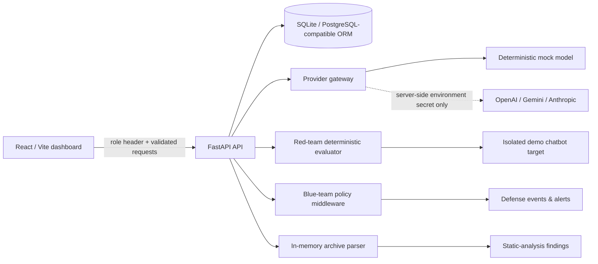

# Bayora architecture

The local Compose topology places frontend, API, red-team-worker, and blue-monitor on an internal bridge network. The current interactive prototype runs deterministic demo suites within the API for immediate feedback; worker services are restricted boundary placeholders and have no arbitrary scan or code-execution capability.

## Trust boundaries

- The browser never receives an API key. Provider records retain only an environment-variable name.
- Test targets require explicit authorization. The implemented execution engine only runs the isolated demo chatbot; external target records are inventory-only.
- Uploaded ZIP files are size-limited, reject traversal paths, are parsed in memory, and are never extracted for execution.
- Blue-team events and red-team results are stored independently; patch approval only records an approval and never writes source files.
- Docker is a local development convenience. It is not a substitute for a hardened sandbox, egress controls, identity provider, or production secrets manager.

